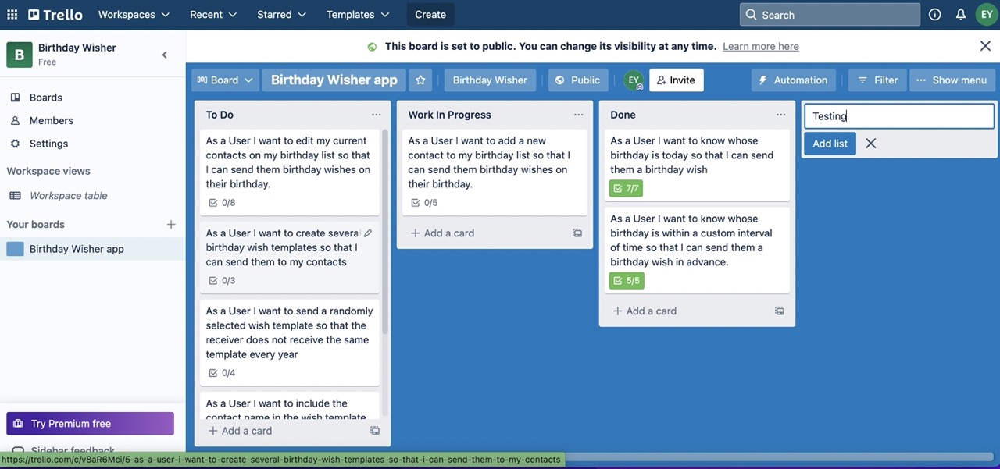
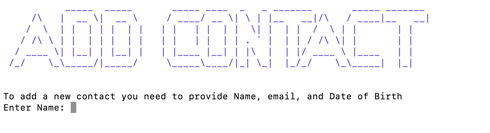
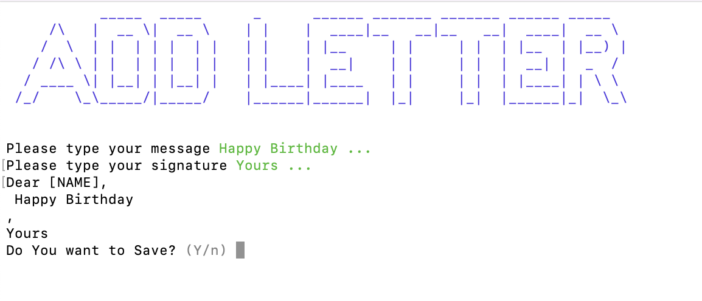

# Link to Repository:

You can find a source code in [here](https://github.com/EEYoussef/Birthday_wisher.git)

# Software Development Plan:


**Purpose:** An application to help the user to send birthday wishes to recipients in a contact list.

**The problem:** If a user has a long list of contacts and wants to send them birthday wishes on their birthday, it will be hard for him/her to remember whose birthday is today. Even if the user relies on a reminder to alert him/herself when each person's birthday is, it will be difficult to manually customize and send a birthday wish to each recipient. This will be a time consuming and tedious task for a long list of recipients.

 **Target Audience:** The application will suit any user who wants to constantly send birthday wishes to a given contact list. For example, a marketing department for an online retail store or a loyalty program.

# Control Flow Diagram:


 # **Scope:** 

**What it will do: **

1. The user can set up the application to send a birthday wish email to a list of contacts on their birthday.

2. The user can edit the contact list. 

3. It will randomly pick an email to send to each of these friends in the contact list.

   

**What it will not do:** 

1. Send the birthday wish via text message.

2. The application will not send photos or pictures to the emails.

3. The user cannot search the contact list by a day within the month, e.g. 13/01/2022The user cannot update the details of more than one contact at a time. After saving a new contact the application will not ask if the user wishes to add another contact.

4. The user cannot search the contact list by date of birth or email. 

5. The application will not save birthdays on a leap year.

6. The year of birth is not included in the date of birth. therefore the age of each contact is not tracked. Some selections will go undo or go back. 

7. The names of the sender or receiver will not include emojis, emoticons, symbols or other languages.

   

# Implementaion plan:

You can find the Trello Board in [here](https://trello.com/invite/b/K25yLiwf/8868b9ed9f09f6d8f275ad025a19ae69/birthday-wisher-app)





# **Requirement/Features:** 

1. The user can create, add, edit details or delete contacts from the list. 
1. To add a contact, the application requires; full name, date of birth and email.
1. After adding the contact, the application will ask the user to review the details before saving.
1. The user can search the contact list only by contact name. 
1. When searching the contact list the user can only one contact from the search results. 
6. The user can search the contact list within a customized interval of calendar months, e.g. birthdays between April and June. 
7. The application will send the recipient a birthday wish to their email with the recipient name in it.  


# **User interaction with the application**

When the user runs the app, they will see a top banner, and a welcoming message. Then a user friendly question asking what does the user want to do. The question is followed by a list of main menu options which the user can navigate by up and down arrows and this is how the user will interact with each feature. then the user can select an option by clicking on Enter key to select. 
The selected menu options will change colour to green so the user will distinguish which option they are on. 
The banner will change according to the options the user selected. For example, when the user selects “Add contact from the menu’ the banner changes to “Add Contact” 
Some of the features will ask the user to enter a few details. When the user selects these features, the app will display a message with instructions on which details the user needs to enter. For example, when the user selects ‘add new contact’ the app will display a message and will first ask the user to enter the contact name. 
After the user enters the name, the app will ask the user to enter an email, then it will ask for the date of birth, in a similar way.  

After hitting ‘Enter’ the option prints beside the question so the user can keep track of their previous choices . 

After entering all the necessary details the application will display all the entries and ask the user if they want to save. 


# **Features:**

The user will be asked to select from a menu of options

## **To know whose birthday is on the day** 

The user needs to select “I want to know whose birthday is today?”. 


And the app will display a readable table of the contacts whose birthday is on the day. Then the app will ask the user if they want to send an email or not. The user needs to enter {Y/N]

**Error handling:**

 When the app asks if the user wants to send an email and the user types anything but ‘y’ or ‘n’ or ‘enter’, the app will display a message ‘inavlid input’ and keep the cursor in place until the user enters a valid answer. 


**To know whose birthday is within a certain interval** the user needs to select “I want to know whose birthday is within an interval”. The app will ask the user to ‘select a From month’ with a list of the 12 calnder months. After the user selects a month the app will ask the user to select a from a ‘To month’ list which displays remaining months of the year. For example if the user selects a ‘From month’April, the ‘To month’ will display from April to December . Then the The app will display the results in a table with all the contacts whose birthday is within this interval. 

**Error handling:** **No errors expected.** 

**To add a new contact** the user needs to select ‘I want to add a contact’ then enter the name, email and date of birth as prompted. At the end the app will ask the user if they want to save. 

**Error handling:** **The name field** accepts only letters: a to z in upper and lower cases. If the user enters any other values the system will display a message ‘invalid name, please try again’ **The email:**  be entered in a valid name format, e.g. [john.smith@gmail.com](mailto:john.smith@gmail.com). If the user enters any other format the system will display a message ‘invalid email, please try again’**The Date of birth:** the system validates the date within each month, and leap year is not included. If the user enters an invalid day, e.g. 31 february, the app will display a message ‘day must be within the range’ and the app will display the range of numbers. 


**To update contact details,** the user needs to select ‘I want to update a contact’. The app will ask the user to ‘enter name’. Then the app will display a list of matched contacts. {screenshot of matched contacts] 

Then the app will ask the user which field they want to change. Here the user can toggle between the name, email, date of birth or exit to the main menu. 

**Error handling: same as adding a new contact feature in point 4.** 

**To remove a contact**, the user selects ‘I want to remove a contact from’. The app will ask the user to enter the name, then the app will display the matched name. Then it will ask the user if they want to delete the contact. **Error handling:** **The name field** accepts only letters: a to z in upper and lower cases. If the user enters any other values the system will display a message ‘invalid name, please try again’

**To add a new letter**, the user selects ‘I want to add a new letter’. The app will ask the user to type their message. with a help text that says [press Ctrl+D or Ctrl +Z to finish]. if the user does not enter a message and clicks on Ctrl +Z, the system will display a default message of ‘Happy birthday’. 

[Screenshot]The message can include english letters, emojis opr emoticons and links but not photos.Then the app will ask the user to enter a signature for their message. 
**Error handling:** If the user entered a signature name that has emojis or emoticon, or symbols the system will, the system will display ‘invalid name please try again’The system will not accept any pasted photos or inserted images. 

**To see all the contacts** the user selects ‘see my contact list’, and the app will display a list of all the contacts included in their list. **Error handling:** **no errors expected** 


**To send a birthday wish to a single person**, the user needs to select ‘I want to send a birthday wish to someone’. Then the app will ask the user to enter the contact name, then the app will ask the user to enter an ending name. 
**Error handling:** If the user entered a signature name that has emojis or emoticon, or symbols the system will, the system will display ‘invalid name please try again’If there is a network disruption while sending the wish, the system will display ‘Error occurred message not sent, please check your account on postmark”

## Varibales /Methods

Class Contact is used to represent a contact entery in the contact file


Method menu_heading is called whenever a  user select a feature and variable title will have the name of the feature.


Constant variables that have values that will not change in the code , For example  API_TOKEN , SENDER_SIGNATURE,BIRTHDAY_FILE_PATH, and LIST_OF_MONTHS . 


# Command line Argument


### Installation 

You will need:
1. Ruby installed. If you don't already have it, you can find it [here](https://www.ruby-lang.org/en/downloads/). 

2. Ruby Gems:
   1. Artii [here](https://rubygems.org/search?query=artii) 
   
   2. tty-prompt  [here](https://rubygems.org/gems/tty-prompt) 
   
   3. colorize [here](https://rubygems.org/gems/colorize)  
   
   4. Json [here](https://rubygems.org/gems/json)
   
   5. Pastel [here](https://rubygems.org/gems/pastel/versions/0.7.1)
   
   6. Bundler  [here](https://help.dreamhost.com/hc/en-us/articles/115001070131-Using-Bundler-to-install-Ruby-gems).
   
      


## Steps to install Birthday Wisher

**To install from Github:**

1. Open terminal

2. Change the working directory to the location where you want the cloned directory.

3. go to the repository that holds the source code [here](https://github.com/EEYoussef/Birthday_wisher.git).

4. Click on Code and copy the link.

5. On your terminal : Type `git clone`, and then paste the URL you copied.

6. .Press **Enter** to create your local clone.

   if any error occurs please check this link from Github [here]
   (https://docs.github.com/en/repositories/creating-and-managing-repositories/cloning-a-repository) 

7. Change to the directory that contains the repository.

8. change directory to the src directory.

```
 cd src
```

9. Type this code into the terminal to start the application.

```
 ./bw.sh
```

## Useful Commands :

To view the help menu type:

```
 ruby main.rb -h
```

For more information about the app type:

```
 ruby main.rb -info
```

For displaying all the list of contact, type:

```
 ruby main.rb -c
```

For displaying all the message templates type:

```
 ruby main.rb -l
```

## Requirments to send an email message from your account :

You will need a Postmark account [start here](https://postmarkapp.com/), server and sender signature (or verified domain) set up to use it.

Please check the [link](https://github.com/wildbit/postmark-gem/wiki/Getting-Started) for further details

For the purpose of this assignment, all these details have been provided in env file and can be downloaded from canvas.


### Potential Ethical, Legal Implications:

### In sending email using an API.

an API Token and email address has been kept in an .env file and  to keep them safe and not shared .

